# Execution Plan — grade2-subjects-coin-rewards

## Detailed Analysis Summary

### Transformation Scope
- **Transformation Type**: Multiple component changes (no architecture change, no infra change)
- **Primary Changes**: UI restructuring in learning-zone.tsx, new coin calculation utility, Grade 2 content in translations.ts
- **Related Components**: quiz-modal.tsx (interface update), lib/coin-rewards.ts (new utility)

### Change Impact Assessment
- **User-facing changes**: Yes — Grade 2 navigation changes from flat to two-level; coin reward amounts change
- **Structural changes**: Minor — new utility module `lib/coin-rewards.ts`; updated `Question` interface adds `difficulty` field
- **Data model changes**: No — no DB schema changes; `quiz_history.coins_earned` continues accepting any integer
- **API changes**: No — existing `/api/quiz/history` POST body is unchanged
- **NFR impact**: Yes — partial PBT tests for coin calculation logic

### Component Relationships
- **Primary Components**: `components/learning-zone.tsx`, `components/quiz-modal.tsx`
- **Supporting Module**: `lib/coin-rewards.ts` (new)
- **Content Module**: `data/translations.ts`
- **Test Module**: `automation_tests/unit/coin-rewards.test.ts` (new)
- **Dependent Components**: `app/page.tsx` (calls `onQuizComplete`) — interface unchanged
- **Infrastructure**: No changes

### Risk Assessment
- **Risk Level**: Medium
- **Rollback Complexity**: Easy (all changes are in frontend TypeScript files, no DB migration)
- **Testing Complexity**: Moderate (new PBT for coin calc, existing unit tests remain)

---

## Workflow Visualization

```mermaid
flowchart TD
    Start(["User Request"])

    subgraph INCEPTION["INCEPTION PHASE"]
        WD["Workspace Detection<br/>COMPLETED"]
        RE["Reverse Engineering<br/>COMPLETED"]
        RA["Requirements Analysis<br/>COMPLETED"]
        US["User Stories<br/>SKIP"]
        WP["Workflow Planning<br/>EXECUTE"]
        AD["Application Design<br/>EXECUTE"]
        UG["Units Generation<br/>EXECUTE"]
    end

    subgraph CONSTRUCTION["CONSTRUCTION PHASE"]
        FD["Functional Design<br/>EXECUTE"]
        NFRA["NFR Requirements<br/>EXECUTE"]
        NFRD["NFR Design<br/>SKIP"]
        ID["Infrastructure Design<br/>SKIP"]
        CG["Code Generation<br/>EXECUTE"]
        BT["Build and Test<br/>EXECUTE"]
    end

    subgraph OPERATIONS["OPERATIONS PHASE"]
        OPS["Operations<br/>PLACEHOLDER"]
    end

    Start --> WD
    WD --> RE
    RE --> RA
    RA --> US
    US --> WP
    WP --> AD
    AD --> UG
    UG --> FD
    FD --> NFRA
    NFRA --> NFRD
    NFRD --> ID
    ID --> CG
    CG --> BT
    BT --> OPS
    OPS --> End(["Complete"])

    style WD fill:#4CAF50,stroke:#1B5E20,stroke-width:3px,color:#fff
    style RE fill:#4CAF50,stroke:#1B5E20,stroke-width:3px,color:#fff
    style RA fill:#4CAF50,stroke:#1B5E20,stroke-width:3px,color:#fff
    style US fill:#BDBDBD,stroke:#424242,stroke-width:2px,stroke-dasharray: 5 5,color:#000
    style WP fill:#FFA726,stroke:#E65100,stroke-width:3px,stroke-dasharray: 5 5,color:#000
    style AD fill:#FFA726,stroke:#E65100,stroke-width:3px,stroke-dasharray: 5 5,color:#000
    style UG fill:#FFA726,stroke:#E65100,stroke-width:3px,stroke-dasharray: 5 5,color:#000
    style FD fill:#FFA726,stroke:#E65100,stroke-width:3px,stroke-dasharray: 5 5,color:#000
    style NFRA fill:#FFA726,stroke:#E65100,stroke-width:3px,stroke-dasharray: 5 5,color:#000
    style NFRD fill:#BDBDBD,stroke:#424242,stroke-width:2px,stroke-dasharray: 5 5,color:#000
    style ID fill:#BDBDBD,stroke:#424242,stroke-width:2px,stroke-dasharray: 5 5,color:#000
    style CG fill:#4CAF50,stroke:#1B5E20,stroke-width:3px,color:#fff
    style BT fill:#4CAF50,stroke:#1B5E20,stroke-width:3px,color:#fff
    style OPS fill:#BDBDBD,stroke:#424242,stroke-width:2px,stroke-dasharray: 5 5,color:#000
    style Start fill:#CE93D8,stroke:#6A1B9A,stroke-width:3px,color:#000
    style End fill:#CE93D8,stroke:#6A1B9A,stroke-width:3px,color:#000
    style INCEPTION fill:#BBDEFB,stroke:#1565C0,stroke-width:3px,color:#000
    style CONSTRUCTION fill:#C8E6C9,stroke:#2E7D32,stroke-width:3px,color:#000
    style OPERATIONS fill:#FFF59D,stroke:#F57F17,stroke-width:3px,color:#000

    linkStyle default stroke:#333,stroke-width:2px
```

---

## Phases to Execute

### INCEPTION PHASE
- [x] Workspace Detection — COMPLETED
- [x] Reverse Engineering — COMPLETED (brownfield)
- [x] Requirements Analysis — COMPLETED
- [ ] User Stories — **SKIP**: Single-developer feature with clear requirements; no multi-persona concerns
- [x] Workflow Planning — IN PROGRESS (this document)
- [ ] Application Design — **EXECUTE**: New component structure needed (two-level nav state, updated QuizModal interface, new coin utility module)
- [ ] Units Generation — **EXECUTE**: Two logical units of work with a dependency

### CONSTRUCTION PHASE (per unit)
- [ ] Functional Design — **EXECUTE**: Business logic for coin calculation, navigation state, content selection needs explicit design
- [ ] NFR Requirements — **EXECUTE** (partial PBT per Q8=B): Coin calculation function requires property-based tests
- [ ] NFR Design — **SKIP**: No infrastructure NFRs; testing patterns are already established in the project
- [ ] Infrastructure Design — **SKIP**: No infrastructure changes (no new APIs, no DB changes)
- [ ] Code Generation — **EXECUTE** (ALWAYS)
- [ ] Build and Test — **EXECUTE** (ALWAYS)

### OPERATIONS PHASE
- [ ] Operations — PLACEHOLDER (future)

---

## Units of Work

### Unit 1: grade2-subjects-nav
**Scope**: Grade 2 two-level subject navigation and new Vietnamese/English Grade 2 quiz content
**Files**: `components/learning-zone.tsx`, `data/translations.ts`
**Dependencies**: Depends on `difficulty` type from Unit 2 (coin-rewards utility)

### Unit 2: coin-rewards-difficulty
**Scope**: `difficulty` field on questions, coin calculation utility, PBT tests
**Files**: `lib/coin-rewards.ts` (new), `components/quiz-modal.tsx`, `components/learning-zone.tsx`, `automation_tests/unit/coin-rewards.test.ts` (new)
**Dependencies**: None (foundational)

**Recommended sequence**: Unit 2 first (provides `Difficulty` type and coin utility), then Unit 1.

---

## Success Criteria
- **Primary Goal**: Grade 2 has subject-level navigation with Math/Vietnamese/English; coin rewards are difficulty-based
- **Key Deliverables**: Updated learning-zone.tsx, updated quiz-modal.tsx, new lib/coin-rewards.ts, updated translations.ts, new coin-rewards tests
- **Quality Gates**:
  - All existing unit tests pass (no regressions)
  - PBT tests for calculateSessionCoins pass
  - TypeScript compilation clean (no errors)
  - ESLint clean
