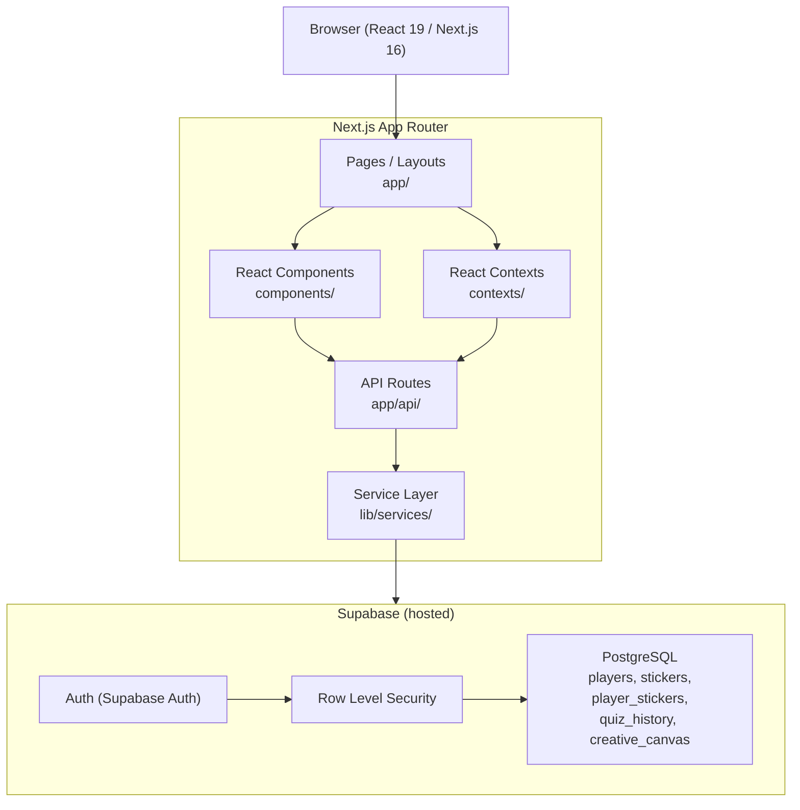
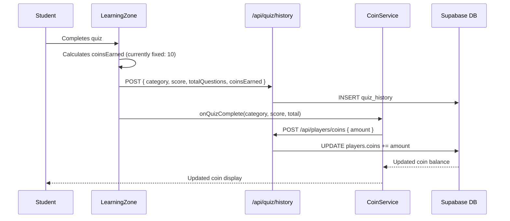

# System Architecture

## System Overview

magichouse is a single-package Next.js 16 monolith deployed as a web application. The frontend is a React 19 SPA-style app using Next.js App Router with client-side rendering for interactive components. The backend is Supabase (PostgreSQL with Auth), accessed via server-side Next.js API routes with Row-Level Security enforced at the database level.

## Architecture Diagram

## Component Descriptions

### app/ (Next.js App Router)
- **Purpose**: Application entry points, layouts, and API route handlers
- **Responsibilities**: Page routing, auth-gated API endpoints, global layout
- **Dependencies**: Supabase server client, service layer
- **Type**: Application

### components/ (React Components)
- **Purpose**: UI layer — all interactive React components
- **Responsibilities**: Rendering learning zone, quiz modal, dashboard, sticker shop, creative room, login/register
- **Dependencies**: React contexts, Lucide icons, Tailwind CSS
- **Type**: Application UI

### contexts/ (React Contexts)
- **Purpose**: Global client-side state management
- **Responsibilities**: Auth state (auth-context), coin balance + sticker ownership (coin-context), language selection (language-context), theme (theme-context)
- **Dependencies**: Supabase client, API routes
- **Type**: Application State

### lib/services/ (Service Layer)
- **Purpose**: Business logic and data access abstraction
- **Responsibilities**: Player CRUD, quiz history recording, sticker transactions, canvas persistence
- **Dependencies**: Supabase client
- **Type**: Application Service

### lib/supabase/ (Supabase Clients)
- **Purpose**: Supabase client factory (browser, server, admin)
- **Responsibilities**: Creating correctly-scoped Supabase clients for different contexts
- **Type**: Infrastructure Client

### supabase/ (Database)
- **Purpose**: Database schema, migrations, seed data
- **Responsibilities**: Table definitions, RLS policies, indexes, triggers
- **Type**: Infrastructure

## Data Flow

## Integration Points

- **External APIs**: Supabase REST/Realtime (via @supabase/ssr and @supabase/supabase-js)
- **Databases**: Supabase PostgreSQL — tables: players, stickers, player_stickers, quiz_history, creative_canvas
- **Third-party Services**: Vercel Analytics (@vercel/analytics)

## Infrastructure Components

- **Deployment Model**: Next.js hosted on Vercel (inferred from @vercel/analytics dependency)
- **Database**: Supabase hosted PostgreSQL with Auth, RLS, and migrations
- **Networking**: Public web — Supabase RLS enforces data isolation per authenticated user
