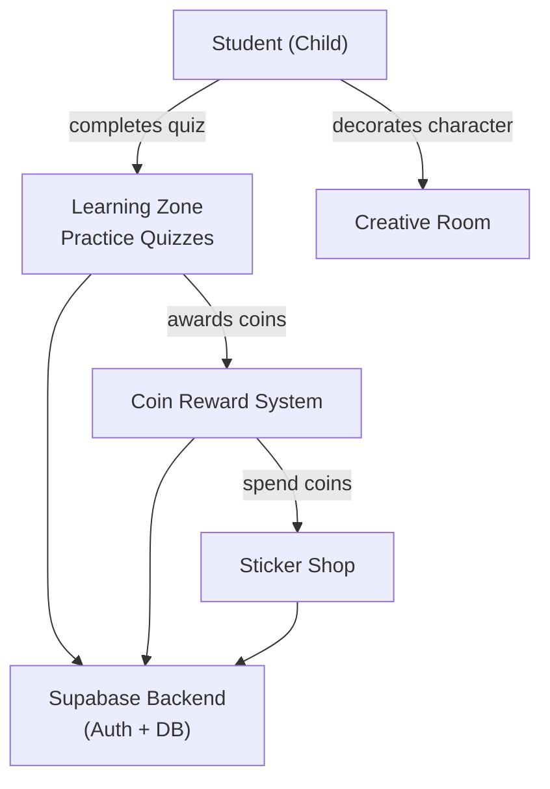

# Business Overview

## Business Context Diagram

## Business Description

- **Business Description**: magichouse is a gamified educational platform for young children (Preschool, Grade 1, Grade 2). Students practice academic subjects through multiple-choice quizzes and earn coins as rewards. Coins can be spent in a sticker shop to decorate an in-app character, providing motivation to continue learning.

- **Business Transactions**:
  - **Complete Quiz**: Student answers a series of questions, receives a score, and earns coins upon completion
  - **Buy Sticker**: Student spends coins to purchase a sticker for their character
  - **Decorate Character**: Student drags stickers onto a canvas to personalize their character
  - **Register/Login**: Student creates an account or signs in via Supabase Auth
  - **View Dashboard**: Student sees available learning zones, coin balance, and navigation options

- **Business Dictionary**:
  - **Grade Level**: Educational grouping (Preschool, Grade 1, Grade 2) determining available practice categories
  - **Category/Practice**: A specific quiz type (e.g., Addition, Times Table, Shapes)
  - **Subject**: A top-level grouping of categories (e.g., Math contains Addition, Subtraction, Times Table)
  - **Coin**: Virtual currency earned by completing quizzes, spent at the Sticker Shop
  - **Difficulty**: Hardness level of a quiz question (Easy, Medium, Hard)
  - **Sticker**: Collectible item purchased with coins, used to decorate the in-app character

## Component Level Business Descriptions

### Learning Zone
- **Purpose**: Central hub where students select and complete practice quizzes by grade level
- **Responsibilities**: Displays grade tabs, category cards, runs quiz sessions, triggers coin rewards on completion

### Coin System
- **Purpose**: Motivational reward loop — earning and spending virtual currency
- **Responsibilities**: Tracks coin balance, processes additions from quiz completions, deductions from sticker purchases, persists to Supabase

### Sticker Shop
- **Purpose**: Provides a spend mechanism for earned coins, reinforcing learning behavior
- **Responsibilities**: Lists available stickers, processes purchase transactions, checks affordability

### Creative Room
- **Purpose**: Creative expression space where students decorate their character with purchased stickers
- **Responsibilities**: Renders character canvas, allows drag/drop placement of stickers, persists canvas state
