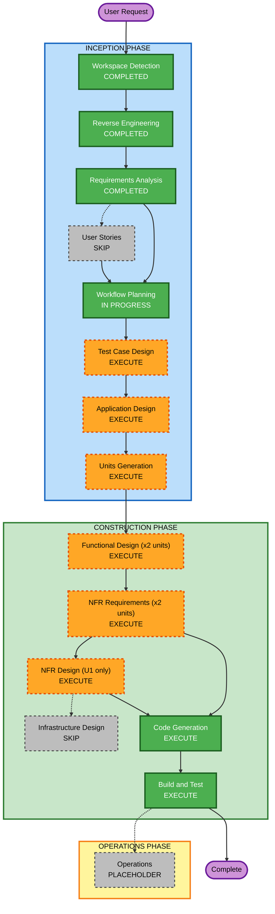

# Execution Plan — my-house

## Detailed Analysis Summary

### Transformation Scope (Brownfield)
- **Transformation Type**: Single-feature addition within the existing monolith — no
  architectural transformation, no deployment-model change, no infrastructure change.
- **Primary Changes**: New DB tables + migration, new service layer, new API routes, a new
  full-screen React component, a dashboard card, an extended context.
- **Related Components**: `components/dashboard.tsx`, `contexts/coin-context.tsx`,
  `lib/database.types.ts`, `data/translations.ts`, `supabase/migrations/`.

### Change Impact Assessment
- **User-facing changes**: Yes — new "My House" dashboard card, Bedroom shopping/decorating flow.
- **Structural changes**: No — fits the existing service-layer/API-route/context architecture.
- **Data model changes**: Yes — 3 new tables (`house_items`, `player_house_items`, `house_layout`).
- **API changes**: Yes — 4 new routes (catalog, ownership, purchase, layout get/save).
- **NFR impact**: Yes, per opted-in extensions — Security (full/blocking), Resiliency (applied,
  mostly resolved N/A for this managed-platform deployment), PBT (full/blocking).

### Component Relationships (Brownfield)
```markdown
## Component Relationships
- **Primary Component**: New house-items/house-layout service + API routes + MyHouse UI
- **Infrastructure Components**: None (Vercel + Supabase managed platform, no IaC)
- **Shared Components**: `contexts/coin-context.tsx` (extended), `data/translations.ts` (extended),
  `lib/database.types.ts` (extended), `lib/api-response.ts`, `lib/validation/api.ts` (reused as-is)
- **Dependent Components**: `components/dashboard.tsx` (adds a 4th card + view branch)
- **Supporting Components**: None new — reuses existing RLS/auth model, existing CI, existing
  Vercel deployment
```

For each related component:
| Component | Change Type | Reason | Priority |
|---|---|---|---|
| `components/dashboard.tsx` | Minor | Add 4th nav card + view switch case | Critical |
| `contexts/coin-context.tsx` | Minor | Add house ownership state + purchase action | Critical |
| `lib/database.types.ts` | Minor | Add generated types for 3 new tables | Critical |
| `data/translations.ts` | Minor | Add localized item names + My House UI chrome | Important |
| `lib/validation/api.ts` | Minor | Add Zod schemas for the 4 new routes | Critical |

### Risk Assessment
- **Risk Level**: Medium — multiple components (DB + 2 services + 4 routes + UI + context), but
  every piece has a direct, working analog already in the codebase (Sticker Shop / Creative Room),
  which substantially de-risks the design.
- **Rollback Complexity**: Moderate — schema migration is forward-only (per Resiliency R4); an
  app-level rollback (Vercel Instant Rollback) is trivial, but reverting an applied schema change
  would need a follow-up migration.
- **Testing Complexity**: Moderate — unit + API + one E2E flow (Q9=C), plus full/blocking PBT
  (Q12=A) on purchase/placement invariants.

## Workflow Visualization



### Text Alternative

```
INCEPTION
- Workspace Detection ....... COMPLETED
- Reverse Engineering ....... COMPLETED
- Requirements Analysis ..... COMPLETED
- User Stories .............. SKIP
- Workflow Planning ......... IN PROGRESS (this stage)
- Test Case Design .......... EXECUTE
- Application Design ........ EXECUTE
- Units Generation .......... EXECUTE  -> produces U1, U2

CONSTRUCTION (per unit, order U1 -> U2)
- Functional Design ......... EXECUTE (both units)
- NFR Requirements .......... EXECUTE (both units, light)
- NFR Design ................ EXECUTE (U1 only — required by Resiliency Baseline's
                               RESILIENCY-14 mandatory question)
- Infrastructure Design ..... SKIP (no new infrastructure)
- Code Generation ........... EXECUTE (always)
- Build and Test ............ EXECUTE (always)

OPERATIONS
- Operations ................ PLACEHOLDER
```

## Phases to Execute

### INCEPTION PHASE
- [x] Workspace Detection (COMPLETED)
- [x] Reverse Engineering (COMPLETED)
- [x] Requirements Analysis (COMPLETED)
- [ ] User Stories — **SKIP**
  - **Rationale**: One primary persona (child) plus a secondary observer persona (parent);
    requirements.md already carries personas, functional requirements written as user-facing
    behavior, and 8 observable acceptance criteria. No multi-stakeholder story-mapping need.
    Matches the precedent set by `subject-content-db`.
- [x] Execution Plan (this document)
- [ ] Test Case Design — **EXECUTE**
  - **Rationale**: User-facing UI (My House screens) and 4 new API routes with observable
    outcomes (AC-1 through AC-8 in requirements.md); Q9=C explicitly asked for unit+API+E2E.
- [ ] Application Design — **EXECUTE**
  - **Rationale**: New service layer (house-items catalog/purchase, house-layout persistence),
    new components (MyHouse, room navigation, item panel), and a coin-context extension all need
    method-level and dependency definition before splitting into units.
- [ ] Units Generation — **EXECUTE**
  - **Rationale**: New data models (3 tables), new API endpoints (4 routes), and state
    management changes (coin-context extension) — clear candidate for a schema/service unit and
    a UI unit, mirroring the `subject-content-db` U1/U2 split.

### CONSTRUCTION PHASE
- [ ] Functional Design — **EXECUTE** (both units)
  - **Rationale**: Business logic (purchase affordability, placement bounds, layout shape) needs
    technology-agnostic definition per unit; also where PBT-01 property identification happens.
- [ ] NFR Requirements — **EXECUTE** (both units, light)
  - **Rationale**: Confirms tech stack choices already implied by requirements.md (fast-check for
    PBT, existing Zod/Supabase patterns) and surfaces anything unit-specific.
- [ ] NFR Design — **EXECUTE** (U1 — schema/service unit — only)
  - **Rationale**: The Resiliency Baseline extension (Q11=A) mandates asking the
    "Resiliency Testing Approach" question (RESILIENCY-14) during NFR Design — this is the one
    remaining Resiliency decision point not already captured in requirements.md. Run once at U1
    since it's a project-wide (not per-unit) decision; U2 will reference U1's answer rather than
    re-asking.
- [ ] Infrastructure Design — **SKIP**
  - **Rationale**: No new infrastructure — Vercel + Supabase managed platform, no IaC, no new
    cloud resources beyond application-level DB tables (matches `subject-content-db` precedent).
- [ ] Code Generation — EXECUTE (ALWAYS)
  - **Rationale**: Implementation planning and code generation needed for both units.
- [ ] Build and Test — EXECUTE (ALWAYS)
  - **Rationale**: Build, unit/API/E2E test execution, and PBT verification needed.

### OPERATIONS PHASE
- [ ] Operations — PLACEHOLDER
  - **Rationale**: Future deployment and monitoring workflows.

## Unit Preview (finalized in Units Generation)
- **U1 — house-schema-and-service**: DB migration (3 tables + RLS), `lib/services/house-items.ts`,
  `lib/services/house-layout.ts`, 4 API routes.
- **U2 — my-house-ui**: `MyHouse` component + room navigation + item panel + Bedroom drag-and-drop
  canvas, `coin-context.tsx` extension, dashboard integration, translations.

(U1 before U2 — U2's client code depends on U1's API contracts and types.)

## Estimated Timeline
- **Total Stages**: 7 INCEPTION/CONSTRUCTION stages beyond what's complete, across 2 units
- **Estimated Duration**: Comparable to `subject-content-db` (2-unit version, no admin unit) —
  a few focused work sessions

## Success Criteria
- **Primary Goal**: Children can buy Bedroom furniture with existing coins and decorate the
  Bedroom, matching all 9 acceptance criteria in requirements.md.
- **Key Deliverables**: Migration + seed, service layer, 4 API routes, MyHouse UI, updated
  coin-context, unit/API/E2E tests, PBT suite, no blocking Security/Resiliency/PBT findings.
- **Quality Gates**: All tests pass; `tsc`/`eslint`/`next build` clean; PBT suite green with seed
  logging; Security/Resiliency compliance re-verified at Build and Test.
- **Integration Testing**: My House coexists with Sticker Shop/Creative Room/Learning Zone
  without regressions (shared coin balance, shared dashboard).
