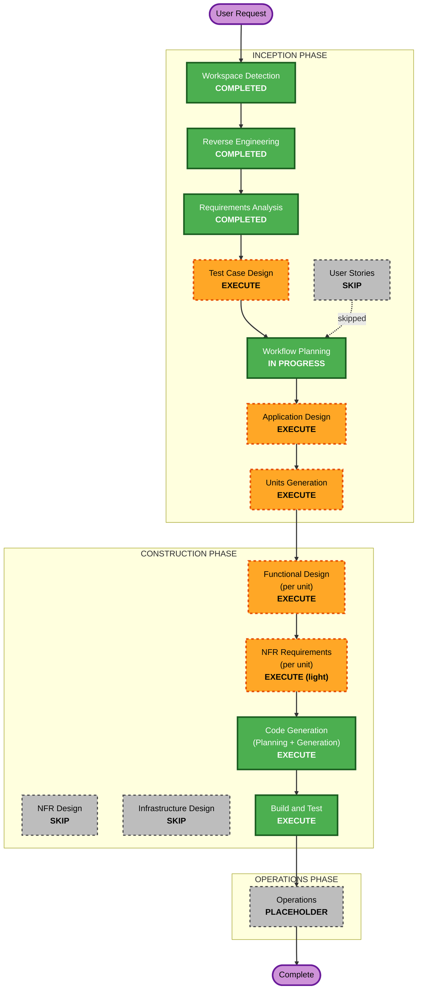

# Execution Plan — subject-content-db

**Status**: Awaiting user approval
**Last updated**: 2026-09-09

---

## Detailed Analysis Summary

### Transformation Scope (Brownfield)
- **Transformation Type**: Application-layer change — data-model addition + content
  migration + API additions + frontend refactor. No infrastructure/deployment-model change
  (same Supabase project, same Vercel host).
- **Primary Changes**:
  1. New DB tables `subjects` + `subject_questions` (+ RLS, indexes) and a `quiz_history`
     CHECK-constraint fix — one idempotent migration.
  2. Content migration from `data/translations.ts` into the DB + ~100 new authored
     questions (Grade 2 Vietnamese & English).
  3. New service `lib/services/` module with server-side language resolution.
  4. New authenticated gameplay questions API route.
  5. New admin CRUD API (email-allowlist gate).
  6. `components/learning-zone.tsx` + `components/quiz-modal.tsx` refactor to async loading
     with loading / error+retry states.
  7. `lib/database.types.ts`, `lib/validation/api.ts`, `.env.local.example` updates.
- **Related Components**: `data/translations.ts` (question keys removed), existing
  `automation_tests/e2e/grade2-subjects.spec.ts` (updated for async loading),
  `.github/workflows/ci.yml` (`INITIATIVE` env var), `vitest.config.ts` (confirm API glob
  already present — it is).

### Change Impact Assessment
- **User-facing changes**: Yes — the language bug fix (Vietnamese subject stays Vietnamese
  with UI in English); a brief loading state; an error+retry state. Otherwise visually
  unchanged.
- **Structural changes**: Yes — content moves from bundle to DB; `learning-zone` gains
  async data flow.
- **Data model changes**: Yes — 2 new tables, 1 constraint change.
- **API changes**: Yes — 1 new gameplay endpoint, a small admin endpoint group. No breaking
  change to existing endpoints.
- **NFR impact**: Low — one small indexed query per quiz open; blocking PBT added; coverage
  threshold unchanged.

### Component Relationships
- **Primary**: new content service + migration
- **Depends on it**: gameplay API, admin API, `learning-zone.tsx`
- **Supporting**: Zod validation, DB types, tests, CI config

### Risk Assessment
- **Risk Level**: Medium
- **Rollback Complexity**: Moderate — revert frontend/service/route files; drop new tables
  (migration is additive; `quiz_history` CHECK change is the only edit to an existing
  object and is itself reversible).
- **Testing Complexity**: Moderate — unit + blocking PBT + API + E2E; async UI states.

---

## Workflow Visualization



### Text alternative
```
INCEPTION:  Workspace Detection [DONE] -> Reverse Engineering [DONE]
         -> Requirements Analysis [DONE] -> User Stories [SKIP]
         -> Test Case Design [EXECUTE] -> Workflow Planning [IN PROGRESS]
         -> Application Design [EXECUTE] -> Units Generation [EXECUTE]
CONSTRUCTION: per unit { Functional Design [EXECUTE] -> NFR Requirements [EXECUTE, light]
                         -> NFR Design [SKIP] -> Infrastructure Design [SKIP] }
           -> Code Generation [EXECUTE] -> Build and Test [EXECUTE]
OPERATIONS: Operations [PLACEHOLDER]
```

---

## Phases to Execute

### INCEPTION PHASE
- [x] Workspace Detection — COMPLETED
- [x] Reverse Engineering — COMPLETED
- [x] Requirements Analysis — COMPLETED
- [ ] User Stories — **SKIP**
  - **Rationale**: Well-specified brownfield change; 3 personas already documented in
    requirements §6; no multi-stakeholder UX exploration or acceptance-criteria discovery
    needed beyond what requirements + Test Case Design cover.
- [ ] Test Case Design — **EXECUTE**
  - **Rationale**: User-facing behaviour (language bug fix, loading/error UI), new API
    contracts, and business logic (session selection, language resolution). Q11=D selected
    unit + API + E2E. This stage locks the TC-E / TC-M list and required `data-testid`s
    before code.
- [ ] Application Design — **EXECUTE**
  - **Rationale**: New components — a content service module, a pure session-selection
    util, two new API route groups — and the `subjects` / `subject_questions` boundary +
    the `fixed`/`localized` resolution contract need defining before decomposition.
- [ ] Units Generation — **EXECUTE**
  - **Rationale**: New data models, multiple API endpoints, layered work (DB → service →
    API → UI) with a clear dependency (gameplay API and admin API both build on the
    schema+service). Decomposition into ~3 units enables ordered/parallel work.

### CONSTRUCTION PHASE (per unit)
- [ ] Functional Design — **EXECUTE**
  - **Rationale**: The language-resolution rules, session-selection invariants, validation
    rules, and the `fixed`/`localized` data shape are non-trivial business logic. PBT-01
    (testable-property identification) is a blocking requirement of the PBT extension and
    is produced here.
- [ ] NFR Requirements — **EXECUTE (light)**
  - **Rationale**: Mostly confirms existing choices, but PBT-09 (framework selection —
    fast-check) MUST be recorded in `tech-stack-decisions.md` per the PBT extension
    enforcement table. Also records the one-query-per-open performance note and the RLS
    stance.
- [ ] NFR Design — **SKIP**
  - **Rationale**: No new NFR patterns or logical components — reuses the existing
    Supabase RLS + Next.js API-route + Zod patterns unchanged.
- [ ] Infrastructure Design — **SKIP**
  - **Rationale**: No infrastructure change. Same Supabase project, same host. The only
    infra artefact is a migration file, applied by the user (Q7=A).
- [ ] Code Generation — **EXECUTE (always)**
- [ ] Build and Test — **EXECUTE (always)**

### OPERATIONS PHASE
- [ ] Operations — PLACEHOLDER

---

## Proposed Units of Work (finalized in Units Generation)

| # | Unit | Responsibility | Depends on |
|---|---|---|---|
| U1 | `content-schema-and-service` | Migration (`subjects`, `subject_questions`, RLS, indexes, `quiz_history` CHECK fix); content seed (migrate existing + author ~100 new Grade 2 VN/EN); `lib/database.types.ts`; content service with `fixed`/`localized` language resolution; PBT for serialization + resolution. | — |
| U2 | `gameplay-content-api-and-ui` | `GET` questions endpoint + Zod; pure `pickSessionQuestions` util (+ PBT); `learning-zone.tsx` async refactor; `quiz-modal.tsx` loading/error/retry; remove migrated keys from `translations.ts`; update `grade2-subjects.spec.ts`; new E2E spec. | U1 |
| U3 | `admin-content-api` | `ADMIN_EMAILS` gate util; `/api/admin/subjects` (list) + `/api/admin/subject-questions` (CRUD); Zod schemas; `.env.local.example`; API tests. | U1 |

**Update strategy**: Sequential U1 → then U2 and U3 (independent, can be done in either
order). Critical path: U1.

---

## Package / Module Change Sequence (Brownfield)
1. `supabase/migrations/` + `lib/database.types.ts` + `lib/services/` (U1) — nothing else
   compiles against the new shape until these exist.
2. `app/api/subjects/**` + `lib/quiz-session.ts` + `components/**` + `data/translations.ts`
   (U2).
3. `app/api/admin/**` + `lib/validation/api.ts` + `.env.local.example` (U3).
4. `automation_tests/**` updated within each unit; `.github/workflows/ci.yml` `INITIATIVE`
   var addressed in Build and Test.

---

## Estimated Timeline
- **Total stages to execute**: 9 (Test Case Design, Application Design, Units Generation,
  then per-unit Functional Design + NFR Requirements ×3, Code Generation, Build and Test)
- **Estimated duration**: 1–2 working sessions, content authoring/review being the largest
  single chunk.

---

## Success Criteria
- **Primary Goal**: Vietnamese subject renders in Vietnamese regardless of UI language;
  Vietnamese/English subject content lives in Supabase and is served via API; Grade 2 VN &
  EN banks expanded to ~50.
- **Key Deliverables**: migration + seed; content service; gameplay API; admin API;
  refactored learning zone + quiz modal; unit + PBT + API + E2E tests; updated docs.
- **Quality Gates**: all 9 acceptance criteria (requirements §9) met; Vitest ≥ 80%
  coverage; no blocking PBT finding; lint + typecheck clean; existing tests still green.
- **Integration Testing**: quiz open → API → render → complete → `quiz_history` insert
  (incl. `grade2Vietnamese`) verified end-to-end.
- **Operational Readiness**: migration documented as a pre-deploy `supabase db push` step.
